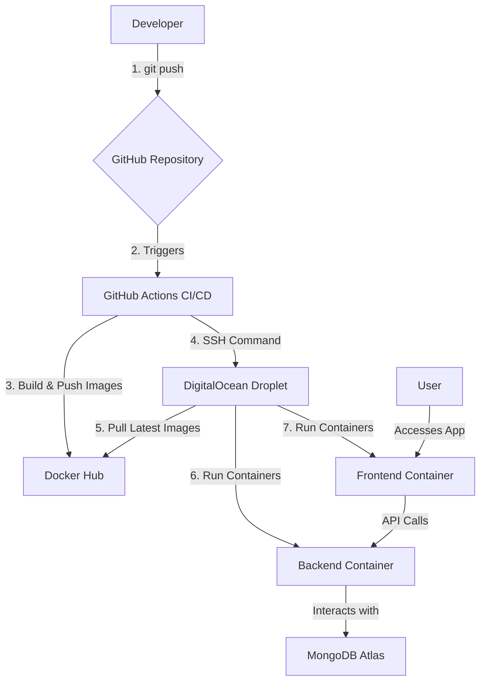

# Full-Stack CI/CD Pipeline for a MERN Application


A comprehensive, production-grade project demonstrating a complete CI/CD lifecycle for a containerized MERN (MongoDB, Express, React, Next.js) application. This repository showcases the automation of building, testing, and deploying a full-stack web application to a cloud server using Docker and GitHub Actions.

**Live Application:** **[http://206.189.35.179:3000/](http://206.189.35.179:3000/)**

---

## 🚀 Project Overview: "Code Snippet Vault"

The core application is a "Code Snippet Vault" — a practical tool for developers to save, organize, and retrieve frequently used code snippets. It's built on a modern MERN stack with a professional, user-friendly interface.

### Key Features
-   **Create, Read, Delete (CRD) Snippets:** Full functionality to manage code snippets.
-   **Project-Based Organization:** Group snippets into different projects (e.g., "E-commerce Site," "Personal Blog").
-   **Dynamic Filtering & Searching:** Instantly filter snippets by project or search by title.
-   **Syntax Highlighting:** Clear and readable code blocks for various languages.
-   **Enhanced UX:** Features like loading states, notifications (toasts), and a "copy to clipboard" function provide a polished user experience.

### Application UI Screenshot

*Caption: The main interface of the Code Snippet Vault, showcasing the project filter and search functionality.*

---

## 🛠️ Tech Stack & Architecture

This project utilizes a modern, industry-standard technology stack to cover the entire development and deployment process.

| Area                  | Technology                                                                                           |
| --------------------- | ---------------------------------------------------------------------------------------------------- |
| **Frontend**          | [**Next.js**](https://nextjs.org/) (React Framework), [**Tailwind CSS**](https://tailwindcss.com/)      |
| **Backend**           | [**Node.js**](https://nodejs.org/), [**Express.js**](https://expressjs.com/)                            |
| **Database**          | [**MongoDB Atlas**](https://www.mongodb.com/atlas) (Cloud Database)                                  |
| **Containerization**  | [**Docker**](https://www.docker.com/) & [**Docker Compose**](https://docs.docker.com/compose/)         |
| **CI/CD**             | [**GitHub Actions**](https://github.com/features/actions)                                              |
| **Cloud Provider**    | [**DigitalOcean**](https://www.digitalocean.com/) (Droplet)                                            |

### Architectural Diagram


---

## 🔄 CI/CD Pipeline Explained

The heart of this project is the automated deployment pipeline configured in `.github/workflows/deploy.yml`.

**Trigger:** The pipeline automatically runs on every `git push` to the `main` branch.

**Pipeline Stages:**
1.  **Checkout Code:** The latest code is checked out from the repository.
2.  **Login to Docker Hub:** Securely logs into Docker Hub using encrypted secrets.
3.  **Build Docker Images:** Builds separate, optimized Docker images for the frontend (Next.js) and backend (Node.js) applications.
4.  **Push to Docker Hub:** Tags the newly built images with `:latest` and pushes them to a public Docker Hub repository.
5.  **Deploy via SSH:**
    -   Securely connects to the DigitalOcean Droplet using an SSH key stored in GitHub Secrets.
    -   Pulls the latest images from Docker Hub.
    -   Stops and removes the old running containers to prevent conflicts.
    -   Starts new containers from the updated images, injecting the `MONGO_URI` environment variable into the backend container.

### GitHub Actions Workflow Screenshot

*Caption: A successful run of the CI/CD pipeline in the GitHub Actions tab.*

---

## 🔧 Local Development & Setup

To run this project on your local machine, you'll need Git, Node.js, and Docker Desktop installed.

1.  **Clone the repository:**
    ```bash
    git clone https://github.com/your-username/your-repo-name.git
    cd your-repo-name
    ```

2.  **Create Environment Variables:**
    -   Create a `.env` file in the `server/` directory.
    -   Create another `.env` file in the project's **root** directory.
    -   Add your MongoDB Atlas connection string to **both** files:
        ```
        MONGO_URI=your_mongodb_connection_string
        ```

3.  **Run with Docker Compose:**
    This is the recommended way to run the application locally, as it mirrors the containerized production environment.
    ```bash
    docker-compose up --build
    ```
    -   Frontend will be available at `http://localhost:3000`.
    -   Backend API will be available at `http://localhost:5000`.

4.  **Run with Node.js (Traditional Method):**
    ```bash
    # Install all dependencies
    npm install concurrently
    cd server && npm install && cd ../client && npm install
    
    # Run both client and server concurrently from the root directory
    cd ..
    npm run dev
    ```

### Server Deployment Screenshot

*Caption: Checking the status of running Docker containers on the DigitalOcean Droplet via SSH.*

---

## 💡 What I've Learned

This project was a deep dive into the full lifecycle of a modern web application. Key takeaways include:
-   **End-to-end DevOps automation** from code commit to live deployment.
-   The power of **containerization with Docker** to create portable, consistent environments.
-   Implementing a robust **CI/CD pipeline using GitHub Actions** to eliminate manual deployment tasks.
-   **Managing infrastructure** on a cloud provider like DigitalOcean.
-   Securely handling sensitive information like API keys and database credentials using **GitHub Secrets**.
-   Building a **full-featured MERN application** with a focus on professional UI/UX.
