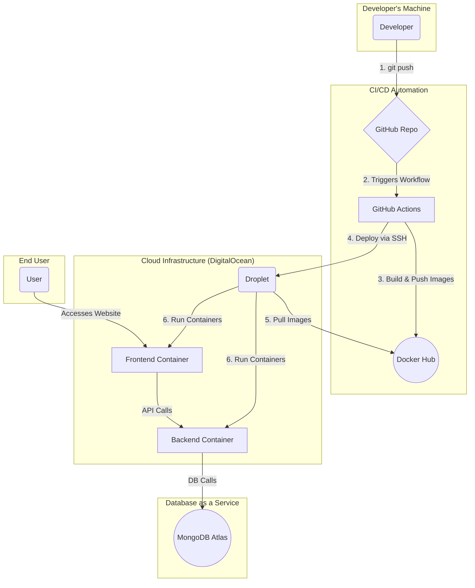

<h1 align="center">
  <br>
  <a href="http://206.189.35.179:3000/"></a>
  <br>
  Full-Stack CI/CD Pipeline for a MERN Application
  <br>
</h1>

<p align="center">A comprehensive, production-grade project demonstrating a complete CI/CD lifecycle for a containerized MERN application. This repository showcases the automation of building, testing, and deploying a full-stack web application to a cloud server using Docker and GitHub Actions.</p>

<p align="center">
  <a href="http://206.189.35.179:3000/"><strong>🚀 View Live Demo 🚀</strong></a>
</p>

<p align="center">
  <a href="#-key-features">Key Features</a> •
  <a href="#-architectural-diagram">Architecture</a> •
  <a href="#-tech-stack">Tech Stack</a> •
  <a href="#-cicd-pipeline">CI/CD Pipeline</a> •
  <a href="#-local-development">Local Setup</a> •
  <a href="#-what-ive-learned">Learnings</a>
</p>


## ✨ Key Features

The core application is a **"Code Snippet Vault"** — a practical tool for developers to save, organize, and retrieve frequently used code snippets.

-   **🗂️ Project-Based Organization:** Group snippets into different projects (e.g., "E-commerce Site," "Personal Blog").
-   **🔍 Dynamic Filtering & Searching:** Instantly filter snippets by project or search by title with a debounced search function.
-   **💻 Syntax Highlighting:** Clear and readable code blocks for various languages with line numbers.
-   **📋 Copy to Clipboard:** Easily copy code snippets with a single click.
-   **💅 Polished User Experience:** Smooth loading states, toast notifications for actions, and a fully responsive design.

---

## 🏛️ Architectural Diagram

This diagram illustrates the flow from a code push to the final deployment on the cloud server.



---

## 🛠️ Tech Stack

| Category           | Technology / Service                                                                                       |
| ------------------ | ---------------------------------------------------------------------------------------------------------- |
| **Frontend**       | [**Next.js**](https://nextjs.org/) (React Framework), [**Tailwind CSS**](https://tailwindcss.com/)           |
| **Backend**        | [**Node.js**](https://nodejs.org/), [**Express.js**](https://expressjs.com/)                                |
| **Database**       | [**MongoDB Atlas**](https://www.mongodb.com/atlas) (Cloud Database)                                      |
| **Containerization** | [**Docker**](https://www.docker.com/) & [**Docker Compose**](https://docs.docker.com/compose/)             |
| **CI/CD**          | [**GitHub Actions**](https://github.com/features/actions)                                                  |
| **Cloud Provider** | [**DigitalOcean**](https://www.digitalocean.com/) (Droplet)                                                |

---

## 🔄 CI/CD Pipeline

The entire deployment process is automated using the workflow defined in `.github/workflows/deploy.yml`.

**Trigger:** The pipeline automatically runs on every `git push` to the `main` branch.

**Key Steps:**
1.  **Checkout & Login:** Checks out the code and securely logs into Docker Hub using encrypted secrets.
2.  **Build & Push:** Builds optimized Docker images for both frontend and backend, and pushes them to Docker Hub.
3.  **Deploy via SSH:**
    -   Securely connects to the DigitalOcean Droplet.
    -   Pulls the latest images, stops/removes old containers, and starts new ones.
    -   Injects the `MONGO_URI` as an environment variable into the backend container for database connectivity.


---

## ⚙️ Local Development

To run this project locally, you need Git, Node.js, and Docker Desktop.

1.  **Clone the Repository:**
    ```bash
    git clone https://github.com/your-username/your-repo-name.git
    cd your-repo-name
    ```

2.  **Setup Environment Variables:**
    -   Create a `.env` file in the `server/` directory.
    -   Create another `.env` file in the project's **root** directory.
    -   Add your MongoDB Atlas connection string to **both** files:
        ```
        MONGO_URI=your_mongodb_connection_string
        ```

3.  **Run with Docker Compose (Recommended):**
    This method mirrors the production setup.
    ```bash
    docker-compose up --build
    ```
    -   App will be available at `http://localhost:3000`.


---

## 🧠 What I've Learned

This project provided hands-on experience with the entire software development lifecycle, from coding to deployment.

-   **Full-Cycle Automation:** Mastered the process of setting up a complete, end-to-end CI/CD pipeline.
-   **Containerization Best Practices:** Learned to create optimized, multi-stage Dockerfiles for a full-stack application.
-   **Infrastructure as Code (IaC) Mindset:** Defined the entire application stack (frontend, backend) in code via `docker-compose.yml`.
-   **Secure Credential Management:** Utilized GitHub Secrets to manage sensitive information like API keys and database URIs, a crucial skill in production environments.
-   **Problem-Solving:** Overcame real-world challenges related to CORS, database connectivity, and environment-specific configurations.
